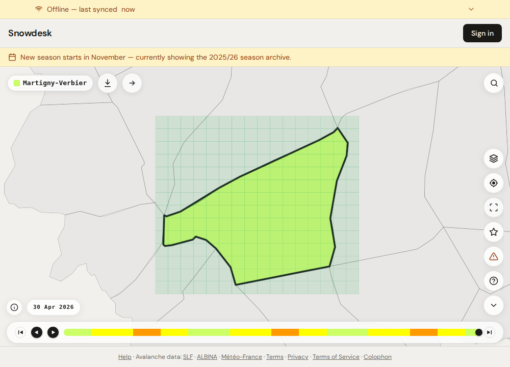
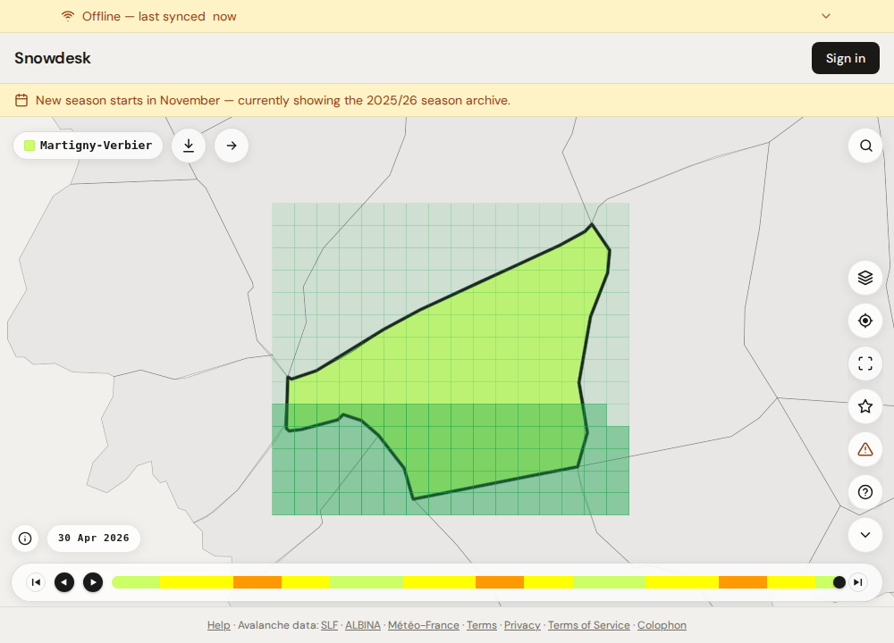
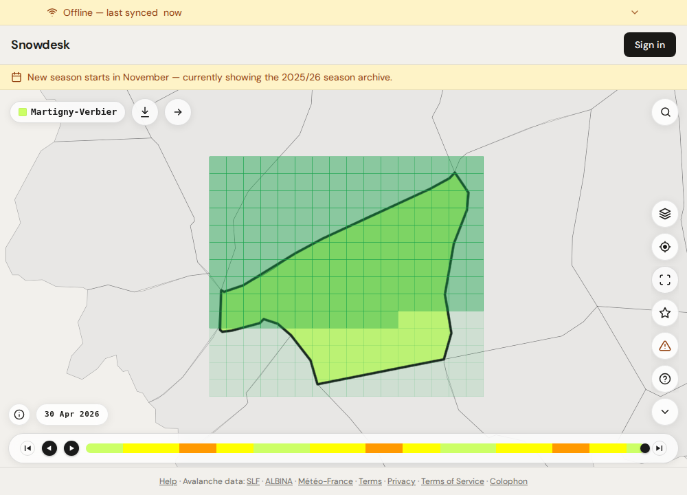
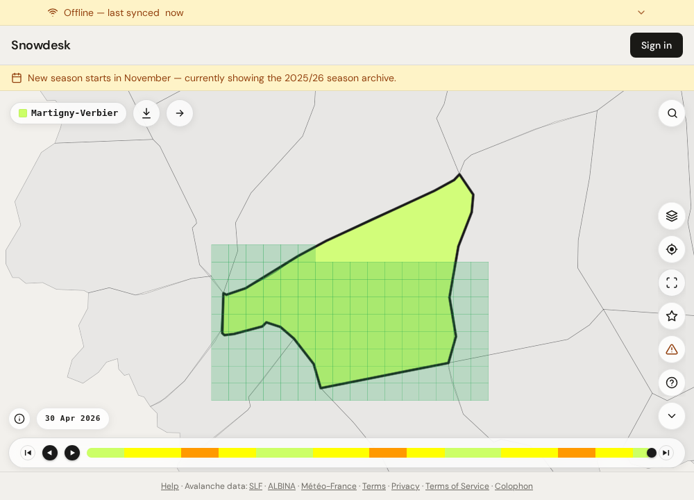

# Download progress grid — screenshots

Captured for the pull request that replaced the rising-water download
progress fill with a grid of real tile footprints.

Region: **Martigny-Verbier** — 224 squares, one per z14 tile (~1.7 km
each). Taken in the Playwright e2e harness, where the basemap CDN is
unreachable, so the region shapes sit on a plain background with no map
tiles beneath them. The grid and the overlay are exactly what ships.

## The grid filling

The grid is up before the first tile lands, so the extent of the download
is visible from the start. Squares complete one at a time because
`tileGridPlan` hands the service worker its URLs grouped cell by cell.

| Empty — nothing fetched yet | Part way through |
| --- | --- |
|  |  |

| Further along | |
| --- | --- |
|  | |

Pending squares carry a faint wash rather than being transparent, so the
download's extent reads as a block even where the squares are only a few
pixels across.

## The cached-tiles overlay

The "Downloaded areas" overlay over a partially-downloaded region — one
square per tile actually present in the pinned cache, read back out of the
cache's own URLs.

The squares extend past the region boundary and are **not** cut by it. A
tile that straddles the boundary is cached whole, and the overlay says so —
the grid draws above every region layer precisely so that nothing tints it
into looking clipped.
